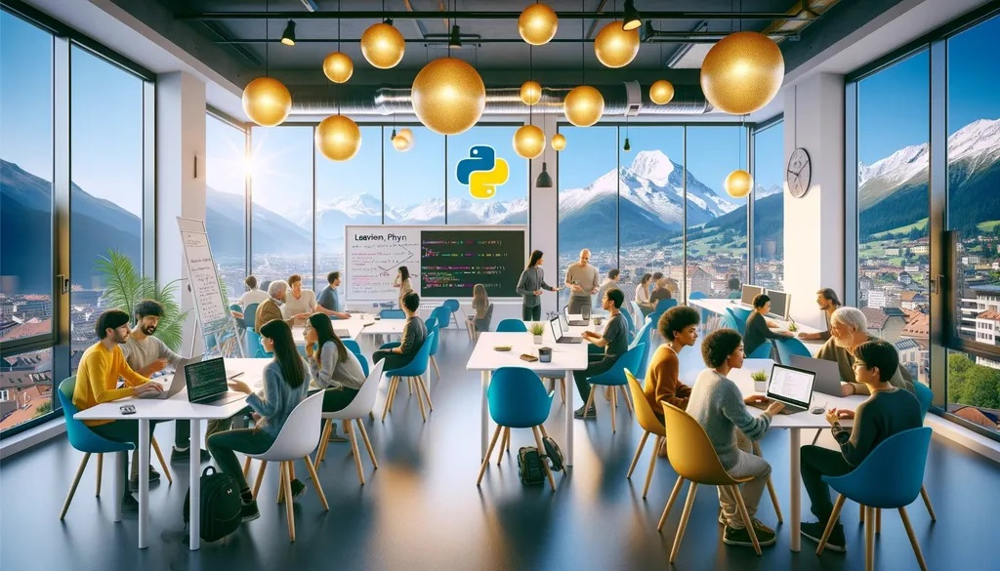

# 🐍 Meetup Python Grenoble



Python user group from [Grenoble (France)](https://www.grenoble.fr) discussing
everything related to the [Python programming language](https://www.python.org),
while still being open to every other languages and technologies!

Register to events on [Meetup.com](https://www.meetup.com/fr-FR/groupe-dutilisateurs-python-grenoble/).

## Development

```bash
pipenv install -d
pipenv shell
mkdocs serve --watch-theme
```
