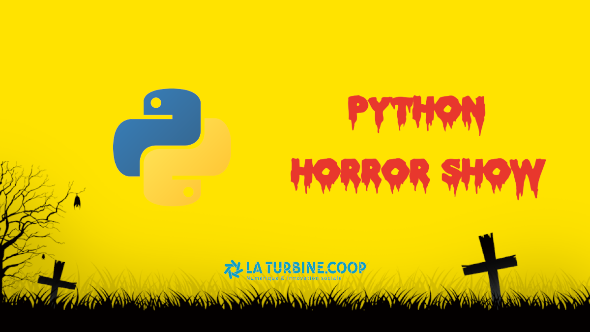

Si les châteaux hantés, les zombies et autres sorcières ne vous font plus assez peur, le meetup Python d'octobre est fait pour vous. Vous y croiserez des exceptions venues d'un autre monde, du code qui donne la chair de poule (request) et peut-être même... des expressions régulières 😱

Dans un format un peu différent des meetups classiques, nous vous proposons de venir de (re-)découvrir de manière ludique certains comportements étranges du code Python ainsi que des extraits de code qui font froid dans le dos.

Merci à la [Turbine.coop](https://turbine.coop/) de continuer à nous accueillir dans ses locaux.
