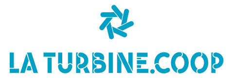

# 🐍 Meetup Python Grenoble

<!--  -->

Python user group from [Grenoble (France)](https://www.grenoble.fr) discussing
everything related to the [Python programming language](https://www.python.org),
while still being open to every other languages and technologies!

!!! tip
    Whatever your relationship and expertise with Python, you are more than
    welcome to attend future events! Simply register to events in advance then
    bring a good dose of cusiosity and a big smile!

## Links

You can find us on the following platforms:

[:fontawesome-brands-meetup: Meetup](https://www.meetup.com/fr-FR/groupe-dutilisateurs-python-grenoble/)

[:fontawesome-brands-github: GitHub](https://github.com/meetup-python-grenoble)

## Submissions

Want to share your experience about something Python-related to the Grenoble
crowd? Please submit your event idea by filling the issue form on GitHub!

[Submit an event](https://github.com/meetup-python-grenoble/meetup-python-grenoble.github.io/issues/new?assignees=&labels=submission&template=submission.yml&title=New+Event+Submission){ .md-button }

### Latest Submissions

<template id="gh-submission-template">
  <article class="gh-submission-item">
    <h4><a class="gh-submission-url" href="">Title</a></h4>
    <small>Submitted by <a class="gh-submission-author" href="">username</small>
  </article>
</template>

## Discussions

If you want to:

- Interact with the Meetup organizers
- Interact with the Meetup community
- Share your ideas
- Checkout the latest announcements
- ...or anything else?

Let's talk on GitHub Discussions!

[Discussions](https://github.com/meetup-python-grenoble/meetup-python-grenoble.github.io/discussions){ .md-button }

## Hosts

[{ width=100 }](https://github.com/mjbright "Michael J Bright")
[{ width=100 }](https://github.com/rclement "Romain Clement")
[{ width=100 }](https://github.com/Pierre-Loic "Pierre-Loïc Bayart")

## Partners

Thanks to all our wonderful partners!

[{ width=200 }](https://turbine.coop "La Turbine.coop Website")

!!! info "Want to be come a partner?"

    Here is what you could do:

    - Hosting events
    - Providing food and drinks
    - Anything that can benefit the community

    In exchange, you get your logo on this page and a 5 minutes pitch at the
    beginning of sponsored events.

    [Become a partner](https://github.com/meetup-python-grenoble/meetup-python-grenoble.github.io/discussions){ .md-button }
