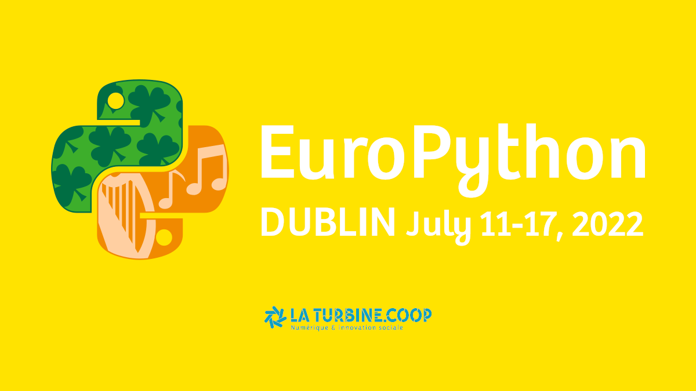

**Après 2 ans et demi d'interruption, le Meetup Python Grenoble est de retour !**

En guise de retrouvailles, nous vous proposons un retour sur la conférence [EuroPython 2022](https://ep2022.europython.eu/) qui s'est déroulée du 11 au 17 juillet 2022 à Dublin, Irlande.
Pierre-Loïc Bayart et Romain Clement étaient sur place et vous feront part de leurs impressions sur l'événement : organisation, thématiques, speakers, ambiance, etc.
Si vous avez toujours voulu assister et/ou participer à une conférence européenne, venez profiter de ce moment d'échange !

[Pierre-Loïc Bayart](https://www.linkedin.com/in/pierreloicbayart/) est ingénieur de formation et formateur indépendant en traitement de données, intelligence artificielle et développement en Python.

[Romain Clement](https://www.linkedin.com/in/romainclement/) est ingénieur et formateur indépendant en développement logiciel et DevOps appliqué au traitement de données et intelligence artificielle.

Merci à la [Turbine.coop](https://turbine.coop/) de continuer à nous accueillir dans ses locaux.
